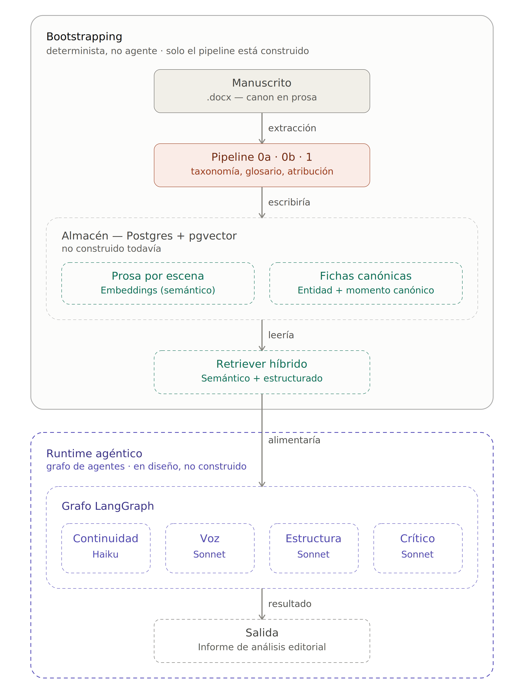

# Sistema agéntico de evaluación editorial de textos narrativos

Un lector automático al que le pides un informe de lectura —¿la trama es
coherente?, ¿los personajes son consistentes?, ¿hay agujeros argumentales?—
tiene el mismo problema de fondo que un corrector de estilo: no tiene memoria
fiable del resto de la obra. Puede señalar como contradicción algo que el
propio texto ya resolvió cien páginas antes, o dar por hecho objetivo lo que
no era sino la fanfarronada de un personaje.

Este proyecto es un intento — todavía en marcha — de construir la base que
un sistema de evaluación editorial necesita para no cometer ese error: no un
agente que reescribe o corrige el texto, sino uno que lo **analiza** —en los
mismos ejes que usaría un lector profesional de editorial: estructura, trama,
personajes, cronología, construcción del mundo, ritmo, temas, simbolismo,
consistencia interna— apoyándose en un canon fijado de antemano, no en lo
que el modelo recuerde a bulto del contexto.

La arquitectura tiene dos partes bien separadas — el diagrama las agrupa en
dos cajas para que se distingan a simple vista: **Bootstrapping**
(determinista) y **Runtime agéntico** (en diseño). Dentro de esas cajas, el
borde sólido marca lo que ya está construido y el discontinuo lo que
todavía no:



1. **Bootstrapping** (determinista, no agente): todo lo que correría una
   sola vez sobre la obra completa. De esto, **solo el pipeline de
   extracción está implementado** — el almacén y el retriever son diseño
   todavía, no código:
   - **Fase 0a — taxonomía documental** *(implementado)*: identifica qué
     tipos de documento contiene la obra (narración, diálogo, documentos
     insertados, paratexto editorial...), a partir de fragmentos reales de
     esa obra, no de una lista genérica fija.
   - **Fase 0b — glosario calibrado** *(implementado)*: identifica
     personajes, lugares, pueblos, objetos y conceptos, fusionando las
     distintas formas en que la obra nombra al mismo referente (epítetos,
     patronímicos, apelativos).
   - **Fase 1 — extracción con atribución** *(implementado)*: usa esa
     calibración como contexto y extrae hechos canónicos, marcando cada
     uno como `narrador_documental` (lo establece el narrador o un
     documento) o `afirmacion_personaje` (lo dice un personaje, sin
     verificación independiente). Esta es la parte que documenta este repo.
   - **Almacén — Postgres + pgvector** *(no construido)*: guardaría lo
     anterior en dos formas — la prosa de la obra dividida por escena y
     vectorizada (para recuperación semántica) y las fichas canónicas de
     la Fase 1, cada una con su `momento_canonico` (para no dar por
     conocido algo que en la obra todavía no se ha revelado).
   - **Retriever híbrido** *(no construido)*: combinaría la búsqueda
     semántica sobre la prosa con consultas estructuradas sobre las
     fichas canónicas.
2. **Runtime agéntico** *(no construido, en diseño)*: el grafo de agentes
   (LangGraph) que consultaría el retriever para producir el análisis
   editorial. Cuatro agentes especializados compartirían ese retriever pero
   evaluarían ejes distintos — continuidad y coherencia interna (Haiku, por
   volumen), voz narrativa (Sonnet), estructura y ritmo (Sonnet), y una
   crítica de conjunto que integra lo anterior (Sonnet) — para producir un
   informe de análisis editorial, no texto reescrito.

## Por qué calibrar antes de extraer

Pedirle a un modelo que extraiga personajes y hechos directamente funciona,
hasta que ejecutas el mismo fragmento dos veces y decide categorías distintas,
o segmenta el mismo personaje bajo dos nombres como si fueran dos entidades.

Por eso el pipeline calibra primero, específicamente para la obra que se le
dé — sin listas fijas inventadas a mano. Cada fase de la Fase 0/1 anterior
corresponde a un script:

| Fase | Script | Detalle |
|---|---|---|
| 0a | `calibrar_taxonomia.py` | Una pasada suele bastar: los marcadores de tipo documental (mayúsculas, notas al pie, etiquetas de hablante) son explícitos. |
| 0b | `calibrar_glosario.py` | Ejecuta N pasadas independientes (por defecto 3) y reconcilia por mayoría, registrando el disenso en vez de ocultarlo — la categoría de una entidad es más ambigua y el modelo no converge igual dos veces. |
| 1 | `extraer_canon.py` | Carga la calibración de 0a y 0b como contexto del prompt de sistema, con prompt caching para no volver a pagar ese contexto en cada fragmento. |

## Caso de estudio: Canto I de la Ilíada

`data/ejemplos/iliada-canto-i/` contiene el fragmento fuente
(`iliada_canto_i.txt`, traducción en prosa del siglo XIX) y la calibración
real (Fases 0a y 0b) ejecutada sobre él — un texto ajeno a cualquier obra
propia, usado como caso de prueba neutral para comprobar que el sistema no
está sobreajustado a un único estilo o estructura narrativa.

Resultados destacables:

- La Fase 0a distinguió, sin que se le pidiera explícitamente, entre la
  narración del poema y el aparato editorial de la edición (encabezados de
  canto, pies de ilustración) — con confianza más baja para este último,
  correctamente, por ser un añadido del editor y no del poema.
- La Fase 0b fusionó correctamente cinco formas distintas de referirse a
  Agamenón ("Atrida", "Atrida Agamenón", "hijo de Atreo", "rey de hombres
  Agamenón"...) en las tres pasadas, sin disenso.
- También registró un desacuerdo real: el término "hecatombe" se dividió
  entre las pasadas que lo clasificaron como objeto ritual concreto y las
  que lo trataron como concepto abstracto — ver
  `discrepancias_calibracion.json`. Ambigüedad legítima del texto, no ruido
  del modelo.

## Estructura del repo

```
src/
  calibrar_taxonomia.py   # Fase 0a
  calibrar_glosario.py    # Fase 0b
  extraer_canon.py        # Fase 1
data/
  ejemplos/
    iliada-canto-i/       # Salida real de calibración sobre el Canto I
  exports/                # (no versionado) salida de tus propias ejecuciones
```

## Uso

Requiere Python 3.11+, [`uv`](https://github.com/astral-sh/uv), y una
`ANTHROPIC_API_KEY` en el entorno.

```bash
# Fase 0a — taxonomía documental (una pasada suele bastar)
uv run python src/calibrar_taxonomia.py --n=1 data/novelas/fragmento.txt

# Fase 0b — glosario calibrado (varias pasadas + reconciliación)
uv run python src/calibrar_glosario.py --n=3 data/novelas/fragmento.txt

# Fase 1 — extracción con atribución (usa la config generada arriba)
# --orden=N es la posición de lectura de este fragmento en la obra
uv run python src/extraer_canon.py --orden=1 data/novelas/fragmento.txt
```

Cada fase escribe en `data/exports/`. Si `extraer_canon.py` no encuentra la
config de la Fase 0, avisa por consola y extrae igualmente, sin esa ayuda.

## Estado del proyecto

Exploratorio, documentado tal como es. El pipeline de extracción (Fases 0a,
0b y 1) está implementado y probado — es lo que documenta este repo. Todo
lo demás —almacén Postgres + pgvector, retriever híbrido, y el grafo de
agentes de evaluación en runtime (continuidad, voz, estructura, crítica de
conjunto)— está en diseño, no en código todavía.

## Licencia

MIT. Ver [LICENSE](LICENSE).
